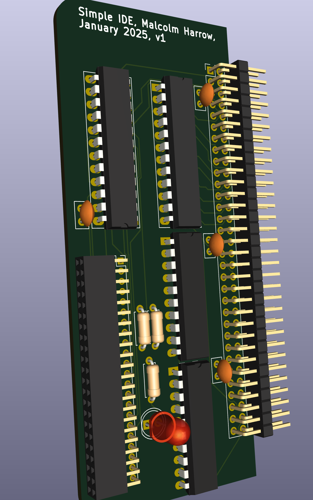
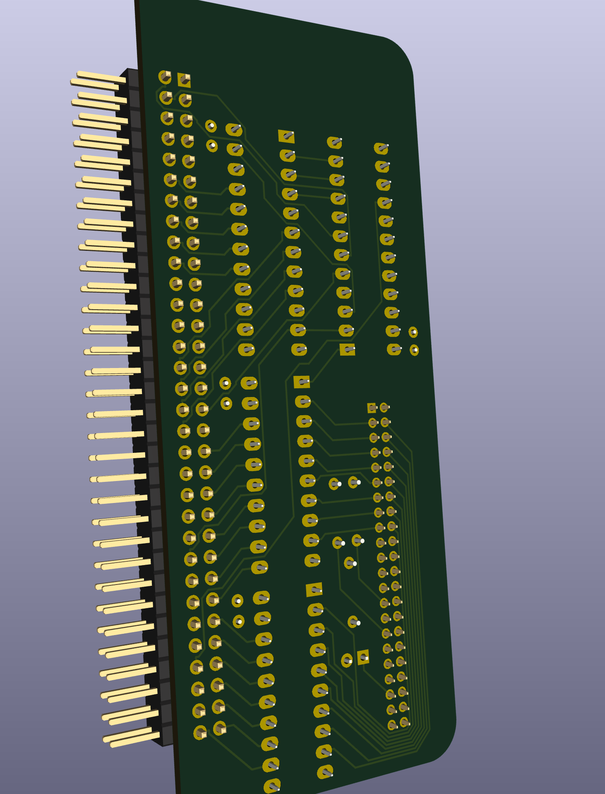

# simple_ide
A very simple IDE interface for the rosco_m68k using two atf22v10 GAL chips

With a lot of thanks to the following projects:  
https://github.com/crmaykish/mackerel-68k/tree/master  
https://github.com/markrvmurray/rosco-ide-ata  

Status as at 11th Feb 2025: This board is not yet working .. the first version has a timing issue on reads.  Working to fix this ..  

To build the rosco firmware with ATA enabled:

    cd
    git clone https://github.com/rosco-m68k/rosco_m68k.git
    cd rosco_m68k/code/firmware/rosco_m68k_firmware
    git submodule update --init --recursive
    WITH_ATA=true ATA_DEBUG=true make clean all

    # copy the ROM images to a SD Card named ROSCO32 on a Mac
    cp rosco_m68k.rom /Volumes/ROSCO32 

.. mmm, had to edit the Makefiule to disable the creation of the rom filesystem as adding in the drivers means the default filesystem doesnt fit into the roms :sob:  
.. double mmm, the generated rom file had an odd size that the in system rom programming utility rejects as invalid.  Patch the file to an even size with the command:  
    
    truncate -s%2 rosco_m68k.rom

    # copy the update flash utility and rom images to a SD card named ROSCO32 on a Mac
    cd
    cd rosco_m68k/code/software
    cp updateflash/updateflash.bin /Volumes/ROSCO32 
